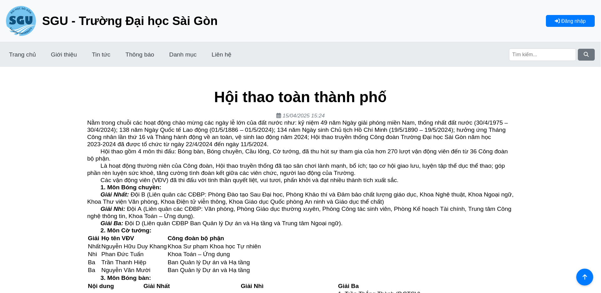

# Chương 2: Nội dung thực tập

## 2.1 XÂY DỰNG HỆ THỐNG WEBSITE THÔNG BÁO (TIN TỨC)

### 2.1.1 Phân tích yêu cầu

#### 2.1.1.1 Yêu cầu nghiệp vụ
**Mục đích:** Xác định các chức năng và tính năng cốt lõi mà hệ thống cần đáp ứng.

**Chi tiết:**
1. **Đăng tải và quản lý bài viết:**
    - Hỗ trợ đăng bài đa phương tiện với văn bản và hình ảnh.
    - Phân loại bài viết theo danh mục, thẻ (tag).
2. **Phân quyền truy cập:**
    - Admin: Toàn quyền đăng bài, chỉnh sửa, xóa bài, quản lý người dùng.
    - Biên tập viên: Đăng bài và chỉnh sửa bài thuộc danh mục được phân công.
    - Người đăng ký: Xem các bài viết riêng tư (nội bộ), chỉnh sửa thông tin cá nhân.
3. **Tìm kiếm và lọc thông tin bài viết:**
    - Tìm kiếm bài viết theo tên, nội dung, danh mục, thẻ.
    - Lọc bài viết theo trạng thái và quyền riêng tư.
4. **Giao diện người dùng:**
    - Responsive design: hiển thị tối ưu trên mọi thiết bị (máy tính, tablet, điện thoại)
    - Navigation trực quan: menu phân cấp rõ ràng.

#### 2.1.1.2 Yêu cầu kỹ thuật
**Mục đích:** Đảm bảo hệ thống hoạt động ổn định, bảo mật và dễ bảo trì.

**Chi tiết:**
1. Bảo mật:
    - Triển khai SSL (HTTPS) để mã hóa dữ liệu truyền tải.
    - Phòng chống tấn công:
        - SQL Injection: Sử dụng prepared statemennts.
        - CSRF: Sử dụng CSRF token.
2. Khả năng mở rộng:
    - Thiết kế module hóa để dễ dàng thêm tính năng trong tương lai.
    - Database thiết kế chuẩn hóa.

#### 2.1.1.3 Yêu cầu phi chức năng
1. Độ tin cậy:
    - Uptime đạt 99%.
    - Backup dữ liệu hàng tuần (database và file media).
2. Khả năng sử dụng:
    - Người dùng không cần đào tạo phức tạp để thao tác.
    - Tài liệu hướng dẫn sử dụng dành cho admin và biên tập viên.
3. Tuân thủ quy định:
    - Đảm bảo nội dung đăng tải phù hợp với chính sách của nhà trường và pháp luật.
    - Có cơ chế kiểm duyệt từ khóa nhạy cảm trong bài viết và bình luật.

#### 2.1.1.4 Ràng buộc và giới hạn
- Phạm vi triển khai ban đầu: tập trung vào nhu cầu cốt lõi (đăng bài; quản lý nội dung, tài khoản).

### 2.1.2 Thiết kế cơ sở dữ liệu

#### 2.1.2.1 Tổng quan Mô hình

- **Loại cơ sở dữ liệu:** Quan hệ (RDBMS) sử dụng MySQL/InnoDB, hỗ trợ ACID và giao dịch.
- **Mục đích:** Quản lý người dùng, bài viết, danh mục, tags, hình ảnh và thông tin trang web.
- **Chuẩn hóa:** Đạt dạng chuẩn 3NF, loại bỏ dư thừa dữ liệu thoogn qua các bảng quan hệ.

#### 2.1.2.2 Phân tích chi tiết.
1. **Bảng `images`**
- **Mục đích:** lưu trữ thông tin hình ảnh (ảnh đại diện, thumbnail bài viết, logo trang web).
- **Trường chính:**
    - `image_id` (PK): Định danh duy nhất.
    - `url`: Đường dẫn tuyệt đối đến hình ảnh (UNIQUE).
    - `name`: Tên file (cho mục đích quản lý).
- **Tối ưu:**
    - Index `image_id` và `url` để tăng tốc truy vấn.

2. **Bảng `siteinfo`**
- **Mục đích:** lưu thông tin cấu hình trang web (chỉ 1 bản ghi duy nhất).
- **Trường chính:**
    - `site_id` (PK): Cố định `TRUE` (ràng buộc `CHECK (site_id = 1)`)
    - `site_logo_id` (FK): Tham chiếu đến logo trong bảng `images`.
    - Các trường thông tin: Tiêu đề, tên trang, thông tin liên hệ, bản quyền.
- **Tối ưu:**
    - Ràng buộc UNIQUE trên `site_id` → Đảm bảo chỉ 1 bản ghi tồn tại.

3. **Bảng `users`**
- **Mục đích:** Quản lý người dùng (admin, author, subscriber).
- **Trường chính:**
    - `user_id` (PK): Định danh người dùng.
    - `phone` và `email`: UNIQUE, dùng làm thông tin đăng nhập.
    - `password`: Lưu trữ mật khẩu đã hash.
    - `role`: Phân quyền với ENUM('admin', 'author', 'subscriber').
    - `avatar_id` (FK): Tham chiếu đến ảnh đại diện trong images.
- **Tối ưu:**
    - Index trên `user_id`, `phone`, `email`, và full-text search (`firstname`, `lastname`).
    - Hạn chế: Chưa có cơ chế xác thực 2 lớp (2FA).

4. **Bảng `posts`**
- **Mục đích:** Quản lý bài viết.
- **Trường chính:**
    - `post_id` (PK): Định danh bài viết.
    - `user_id` (FK): Tác giả bài viết.
    - `slug` (UNIQUE): URL thân thiện SEO.
    - `thumbnail_id` (FK): Tham chiếu ảnh thumbnail trong images.
    - `status`: Trạng thái bài viết (draft/published).
    - `private`: Bài viết riêng tư (chỉ hiển thị với quyền cụ thể).
- **Tối ưu:**
    - FULLTEXT index trên `title` và `body` → Hỗ trợ tìm kiếm nội dung.
    - Index trên `user_id`, `slug`.

5. **Bảng `categories`**
- **Mục đích:** Quản lý danh mục tin tức đa cấp.
- **Trường chính:**
    - `category_id` (PK): Định danh danh mục.
    - `parent_category_id` (FK): Tham chiếu danh mục cha (cho phép đa cấp).
    - `name` và `slug` (UNIQUE): URL thân thiện SEO.
- **Tối ưu:**
    - Index trên `category_id`, `parent_id`, `slug`.

6. **Bảng `post_categories`**
- **Mục đích:** Liên kết nhiều-nhiều giữa bài viết và danh mục.
- **Trường chính:**
    - `post_id` (PK, FK) và `category_id` (PK, FK).
- **Tối ưu:**
    - Sử dụng ON DELETE CASCADE → Xóa bài viết/danh mục sẽ tự động xóa liên kết.

7. **Bảng `tags`** và **post_tags**
- **Mục đích:** Quản lý tags và liên kết với bài viết.
- **Tối ưu:**
    - `name` và `slug` trong tags là UNIQUE → Tránh trùng lặp.
    - `post_tags` sử dụng composite PK (`post_id`, `tag_id`) và CASCADE để đảm bảo toàn vẹn dữ liệu.

#### 2.1.2.3 Đánh giá Tổng thể
1. **Ưu điểm**
- Toàn vẹn dữ liệu:
    - Sử dụng FOREIGN KEY với `ON DELETE CASCADE/SET NULL` → Tránh dữ liệu orphan.
    - Ràng buộc UNIQUE trên các trường quan trọng (`slug`, `email`, `phone`).
- Hiệu suất:
    - Index được áp dụng triệt để trên các trường truy vấn thường xuyên.
    - FULLTEXT index hỗ trợ tìm kiếm nội dung bài viết.
- Tính mở rộng:
    - Danh mục đa cấp qua `parent_category_id`.
    - Dễ dàng thêm tính năng (ví dụ: bảng `comments`).

2. **Điểm cần cải thiện**
- Bảo mật:
    - Thiếu xác thực 2 lớp (2FA) cho tài khoản admin.
    - Chưa có cơ chế giới hạn số lần đăng nhập sai.
- Lưu trữ hình ảnh:
    - Thiếu trường `alt_text` cho SEO và `size` để quản lý dung lượng.
- Quản lý phiên bản bài viết:
    - Chưa hỗ trợ lưu lịch sử chỉnh sửa (versioning).

#### 2.1.2.4 Hướng cải tiến
- Bảo mật:
    - Thêm 2FA cho tài khoản admin.
    - Sử dụng JWT hoặc OAuth2 cho API (nếu có).
- Lưu trữ hình ảnh:
    - Thêm trường `alt_text`, `width`, `height`.
- Tính năng mở rộng:
    - Thêm bảng `post_versions` để lưu lịch sử chỉnh sửa bài viết.
    - Tích hợp Elasticsearch để tối ưu tìm kiếm FULLTEXT.

### 2.1.3 Công nghệ

#### 2.1.3.1 Lựa chọn công nghệ
1. **MySQL**
    - **Lý do lựa chọn:**
        - Là hệ quản trị cơ sở dữ liệu quan hệ (RDBMS) phổ biến, dễ triển khai và quản lý.
        - Phù hợp với quy mô dự án vừa và nhỏ, đặc biệt khi cần truy vấn phức tạp và quan hệ dữ liệu đa chiều.
        - Cộng đồng hỗ trợ lớn, tài liệu phong phú, dễ tìm kiếm giải pháp cho các vấn đề thường gặp.
    - **Tối ưu cho dự án:**
        - Sử dụng InnoDB để hỗ trợ transaction (ACID), phù hợp với nghiệp vụ đăng bài và quản lý người dùng.
        - Không yêu cầu cấu hình phức tạp, dễ tích hợp với Go qua driver như `go-sql-driver/mysql`.

2. **Go (Golang)**
    - **Lý do lựa chọn:**
        - Ngôn ngữ đơn giản, dễ học, cú pháp gọn gàng, phù hợp với developer muốn tập trung vào logic nghiệp vụ.
        - Hiệu suất cao nhờ cơ chế biên dịch trực tiếp (compile) và quản lý bộ nhớ hiệu quả (garbage collection).
        - Hỗ trợ concurrency mạnh mẽ qua goroutine và channel, xử lý tốt các tác vụ I/O-bound (ví dụ: xử lý API đồng thời).
    - **Tối ưu cho dự án:**
        - Tạo RESTful API nhẹ nhàng, tốc độ phản hồi nhanh, phù hợp với lượng truy cập vừa phải của website trường học.
        - Dễ dàng triển khai dưới dạng binary, không phụ thuộc vào môi trường runtime.

3. **Chi Framework**
    - **Lý do lựa chọn:**
        - Là framework tối giản, tập trung vào việc xây dựng API và routing, không áp đặt cấu trúc dự án phức tạp.
        - Tương thích tuyệt vời với thư viện chuẩn của Go (net/http), giúp tận dụng tối đa sức mạnh native của ngôn ngữ.
        - Hỗ trợ middleware linh hoạt để xử lý logging, authentication, CORS... với code tối thiểu.
    - **Tối ưu cho dự án:**
        - Routing rõ ràng, dễ quản lý các endpoint.
        - Không yêu cầu cấu hình phức tạp, phù hợp với mục tiêu "keep it simple".

4. **HTMX Library**
    - **Lý do lựa chọn:**
        - Thư viện siêu nhẹ (kích thước ~14KB), cho phép xây dựng ứng dụng web động (AJAX, WebSocket) mà không cần viết JavaScript phức tạp.
        - Tích hợp trực tiếp vào HTML thông qua các thuộc tính như `hx-get`, `hx-post`, giúp frontend đơn giản và dễ bảo trì.
        - Phù hợp với mô hình "HTML over the wire", giảm thiểu logic phía client.
    - **Tối ưu cho dự án:**
        - Xử lý các tương tác đơn giản như tải nội dung động, form submission mà không cần React/Vue.
        - Giảm thời gian phát triển và độ phức tạp của frontend.

5. **Frontend: HTML/CSS/JavaScript Vanilla**
    - **Lý do lựa chọn:**
        - Không phụ thuộc vào framework như React/Vue → Giảm thời gian học tập, tối ưu hiệu suất tải trang.
        - Dễ dàng tùy chỉnh giao diện với CSS thuần, không lo xung đột phiên bản hoặc breaking changes.
        - Tương thích mọi trình duyệt, không yêu cầu build step phức tạp (Webpack, Babel).
    - **Tối ưu cho dự án:**
        - Sử dụng Vanilla JavaScript để xử lý các tác vụ đơn giản như form validation, hiển thị/ẩn nội dung.
        - Kết hợp với HTMX để thêm tính năng động mà vẫn giữ codebase tối giản.

#### 2.1.3.2 Tổng hợp Ưu điểm của Tech Stack
1. Đơn giản và dễ bảo trì:
    - Số lượng công nghệ tối thiểu, không có sự chồng chềnh giữa các layer.
    - Go và Chi giúp backend gọn nhẹ, dễ debug.

2. Hiệu suất cao:
    - Go xử lý hàng ngàn request cùng lúc nhờ goroutine.
    - Frontend tải nhanh do không có framework cồng kềnh.

3. Chi phí thấp:
    - MySQL và các thư viện mã nguồn mở (Go, HTMX) giảm thiểu chi phí licensing.
    - Dễ triển khai trên server giá rẻ (DigitalOcean, AWS EC2).

4. Linh hoạt mở rộng:
    - Có thể thêm caching (Redis) hoặc CDN khi cần xử lý lượng truy cập lớn.
    - Dễ tích hợp thêm tính năng (ví dụ: Elasticsearch cho tìm kiếm nâng cao).

### 2.1.4 Xây dựng
#### 2.1.4.1 Quy trình Phát triển theo Waterfall

- Phương pháp luận: Waterfall với các giai đoạn tuần tự, tập trung vào hoàn thiện từng bước trước khi chuyển sang giai đoạn tiếp theo.
- Các giai đoạn chính:
    1. Phân tích yêu cầu:
        - Thu thập yêu cầu từ phía nhà trường, xác định chức năng chính (đăng bài, quản lý danh mục, phân quyền).
        - Tài liệu hóa yêu cầu nghiệp vụ và kỹ thuật.
    2. Thiết kế hệ thống:
        - Thiết kế cơ sở dữ liệu (ERD), xây dựng sơ đồ lớp cho Model trong MVC.
        - Thiết kế giao diện người dùng (wireframe) và API endpoints.
    3. Phát triển:
        - Backend (Go/Chi):
            - Code các Controller xử lý API.
            - Triển khai Model để kết nối và truy vấn database.
        - Frontend:
            - Viết View bằng HTML/CSS, tích hợp HTMX để gọi API và cập nhật DOM.
    4. Kiểm thử:
        - Kiểm thử từng module:
            - Unit test cho Model và Controller bằng thư viện testing của Go.
            - Kiểm thử giao diện trên nhiều trình duyệt (Chrome, Firefox, Safari).
        - Kiểm thử tích hợp toàn hệ thống.
    5. Triển khai:
        - Deploy backend lên server Ubuntu sử dụng Docker.
        - Cấu hình Nginx làm reverse proxy và host frontend.
    6. Bảo trì:
        - Theo dõi lỗi và cập nhật tính năng theo yêu cầu phát sinh.

#### 2.1.4.2 Kiến trúc tổng quan
Hệ thống được thiết kế theo mô hình **MVC** (Model-View-Controller), phân tách rõ ràng các thành phần để dễ quản lý và bảo trì:


- **Model:**
    - Xử lý logic dữ liệu, kết nối với cơ sở dữ liệu MySQL.
    - Định nghĩa các struct trong Go (ví dụ: User, Post, Category) và thao tác CRUD thông qua thư viện `go-sql-driver/mysql`.
- **View:**
    - Giao diện người dùng được xây dựng bằng HTML, CSS, JavaScript nguyên bản, kết hợp HTMX để xử lý các tương tác động.
    - Trách nhiệm hiển thị dữ liệu từ Controller mà không chứa logic nghiệp vụ.
- **Controller:**
    - Được triển khai bằng Go và framework Chi, tiếp nhận request từ client, điều phối logic giữa Model và View.
    - Xử lý các API endpoints, xác thực người dùng, và trả về response phù hợp.

### 2.1.5 Một số hình ảnh Demo
1. **Giao diện người dùng**

|  |  |  |
| --------------- | --------------- | --------------- |
| Trang chủ | Danh mục | Chi tiết bài viết |
2. **Trang Admin**

|  |  |  |
| --------------- | --------------- | --------------- |
| Quản lý tài khoản | Quản lý danh mục | Quản lý bài viết |

---
---

## 2.2 CÀI ĐẶT VÀ CẤU HÌNH DEBIAN SERVER CHO HỆ THỐNG THI

### 2.2.1 Cài đặt hệ điều hành Debian Server
1. **Khởi động từ USB cài đặt**
    - Khởi động lại máy, nhấn phím **F12/F2/Del/Esc** (tùy mainboard) để vào Boot Menu.
    - Chọn USB làm thiết bị khởi động.
    - **Lưu ý**: Nếu dùng UEFI, tắt Secure Boot (nếu gặp lỗi).

2. **Màn hình GRUB**

    |  |
    | --------------------------- |
    | Chọn **Graphical install** (cài đặt với giao diện đồ họa). |

3. **Ngôn ngữ và Vùng**

    |  |  |  |
    | --------------- | --------------- | --------------- |
    | Chọn Ngôn ngữ | Chọn Vùng | Chọn bàn phím |

4. **Cấu hình mạng**

    |  |  |
    | --------------- | --------------- |
    | Hostname: Đặt tên máy  | Domain name: Bỏ trống nếu không cần. |

5. **Thiết lập người dùng và mật khẩu**

    |  |
    | --------------------------- |
    Thiết lập mật khẩu cho tài khoản `root`

    |  |  |  |
    | --------------- | --------------- | --------------- |
    | Tạo người dùng | Đặt username cho tài khoản | Đặt mật khâu cho tài khoản |

6. **Cấu hình giờ**

    |  |
    | ------------- |
    | Tạm thời chọn bất cứ cái nào đều được |

7. **Phân vùng ổ cứng**

    |  |
    |-----------------------------|
    Để dễ dàng nhất cho cài đặt, bấm Guided – use entire disk

    |  |
    |-----------------------------|
    Nếu chỉ có một ổ đĩa cứng thì chọn mặc định

    |  |
    |-----------------------------|
    Chọn All files in one partition (recommended for new users)

    |  |
    |-----------------------------|
    Chọn Finish partitioning and write changes to disk

    |  |
    |-----------------------------|
    Chọn **Yes**

6. **Cấu hình cài đặt gói tin**

    |  |
    |-----------------------------|
    Do ta dùng bản DVD Image đầy đủ nên chọn **No**

7. **Cài đặt hệ thống**

    |  |
    |-----------------------------|
    Tích vào web server, SSH server, standard system utilities

8. **Hoàn tất cài đặt**

    |  |
    |-----------------------------|
    Đợi quá trình cài đặt hoàn tất và nhấn Continue để khởi động lại.

### 2.2.2 Cấu hình hệ thống để triển khai phần mềm thi
Đăng nhập tài khoản **root** với mật khâu đã cài đặt bằng lệnh `su -`

1. **Cấu hình múi giờ**<br>
    Chạy lệnh sau: `timedatectl set-timezone Asia/Ho_Chi_Minh`

2. **Thiết lập ip tĩnh**
    - Mở file interfaces với lệnh: `nano /etc/network/interfaces`
    - Sửa `iface eth0 inet dhcp` (giả sử cần thiết lập ip tĩnh với các thông số sau):
        ```
        iface eth0 inet static
        address 192.168.1.10
        gateway 192.168.1.1
        dns-nameservers 8.8.8.8
        ```
    - Khởi động lại dịch vụ mạng để nhận địa chỉ IP mới: `systemctl restart networking `

3. **Cài đặt PHP**
    - Chạy lệnh sau để cấu hình APT sử dụng đúng các kho lưu trữ online:
        ```
        echo 'deb http://deb.debian.org/debian bookworm main contrib non-free non-free-firmware
        deb-src http://deb.debian.org/debian bookworm main contrib non-free non-free-firmware
        deb http://deb.debian.org/debian-security/ bookworm-security main contrib non-free non-free-firmware
        deb-src http://deb.debian.org/debian-security/ bookworm-security main contrib non-free non-free-firmware
        deb http://deb.debian.org/debian bookworm-updates main contrib non-free non-free-firmware
        deb-src http://deb.debian.org/debian bookworm-updates main contrib non-free non-free-firmware' > /etc/apt/sources.list
        ```
    - Tiếp theo, thêm kho lưu trữ PHP:
        ```
        wget -O /etc/apt/trusted.gpg.d/php.gpg https://packages.sury.org/php/apt.gpg && \
        echo "deb https://packages.sury.org/php/ $(lsb_release -sc) main" > /etc/apt/sources.list.d/php.list
        ```
    - Cài đặt PHP 8.4 và các thành phần cần thiết:
        ```
        apt update
        apt install php8.4 php8.4-{cli,zip,mysql,bz2,curl,mbstring,intl,common,zip,xml,gd,opcache,imagick} -y
        ```

4. **Cài đặt Apache 2 hỗ trợ PHP 8.4**
    - Cài đặt Apache: `apt install apache2 apache2-utils -y`
    - Kích hoạt mod PHP 8.4 trong Apache 2: `a2enmod php8.4`
    - Khởi động lại Apache 2: `systemctl restart apache2`

5. **Cài đặt MariaDB**
    - Cài đặt MariaDB: `apt install mariadb-server mariadb-client -y`
    - Thiết lập MariaDB: `mysql_secure_installation`
        |  |
        | ------------- |
        | Ấn Enter để nhập password rỗng mặc định |

        |  |
        | ------------- |
        | Chọn **Y** ấn Enter |

        |  |
        | ------------- |
        | Chọn **Y** ấn Enter |

        |  |
        | ------------- |
        | Điền mật khẩu mới và nhập lại. |

        |  |
        | ------------- |
        | Chọn **Y** ấn Enter |

        > Các bước tiếp theo tiếp tục điền **Y** và Enter cho đến khi xong

    - Cấu hình Mariadb để hỗ trợ mysqli_multi_query trong PHP:
        ```
        echo 'max_allowed_packet=2G' >> /etc/mysql/mariadb.conf.d/50-server.cnf
        ```
    - Khởi động lại MariaDB: `systemctl restart mariadb`

6. **Cài đặt phpMyAdmin**
    - Cài đặt phpMyAdmin: `apt install phpmyadmin -y`
        |  |
        | ------------- |
        | Chọn apache2 và OK (Chọn bằng phím cách và Dùng phím Tab để di chuyển) |

        |  |
        | ------------- |
        | Chọn **Yes** ấn Enter |

        |  |
        | ------------- |
        | Enter để tiếp tục |
    - Phân quyền thư mục /var/www/html cho người dùng www-data: `chown -R www-data:www-data /var/www/html`
    - Khởi động lại Apache 2: `systemctl restart apache2`

7. **Cấu hình nâng cao**
    - Chỉnh sửa tệp tin php.ini bằng lệnh: `nano /etc/php/8.4/apache2/php.ini`. Tìm và cấu hình các thông số tối thiểu như bên dưới (xóa dấu `;` trước mỗi dòng tương ứng nếu có):
        ```
        max_execution_time = 600
        max_input_time = 600
        memory_limit = 2048M
        post_max_size = 80M
        upload_max_filesize = 800M
        extension=gd
        extension=intl
        extension=mbstring
        extension=mysqli
        extension=xsl
        extension=zip
        ```
    - Kích hoạt module rewrite: `a2enmod rewrite`
    - Chỉnh sửa tệp tin cấu hình website mặc định của Apache2: `nano /etc/apache2/sites-available/000-default.conf`
        |  |
        | ------------- |
        | Thay đổi nội dung file tương tự như trên |
    - Khởi động lại Apache2: `systemctl restart apache2`
    - Tạo thư mục public trong /var/www/html/: `mkdir /var/www/html/public`
    - Tạo tệp tin info.php trong /var/www/html/public: `nano /var/www/html/public/info.php`
        ```
        <?php
        phpinfo();
        ?>
        ```
